 # Hellogram APP IN FLUTTER  
 
hellogram is a fully functional social media app with multiple features built with flutter and dart.

Star⭐ the repo if you like what you see😉.

## Screenshots
    
<table border>
    <tr>
        <th style="text-align:center">Home</th>
      <th style="text-align:center">Emotion Home</th>
        <th style="text-align:center">Story</th>
        <th style="text-align:center">Search</th>
    </tr>
    <tr>
        <td>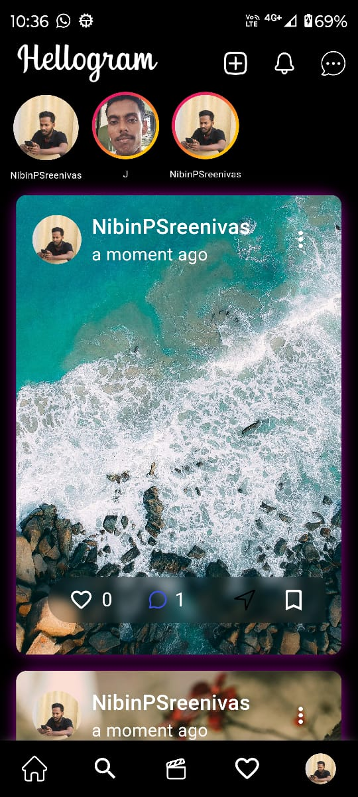</td>
        <td>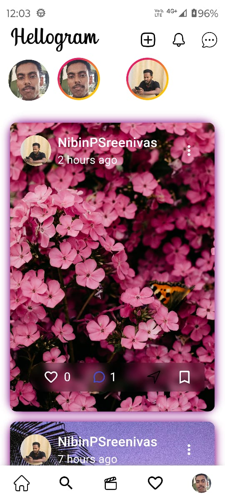</td>
          <td></td>
         <td>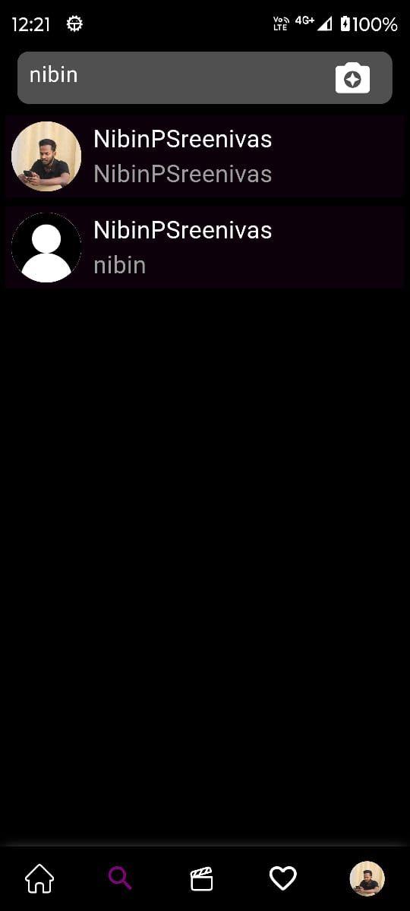</td>
    <tr>
</table>
 
<table border>
    <tr>
        <th style="text-align:center">Landing page</th>
      <th style="text-align:center">login page</th>
        <th style="text-align:center">Photo Register</th>
        <th style="text-align:center">Register page</th>
    </tr>
    <tr>
        <td>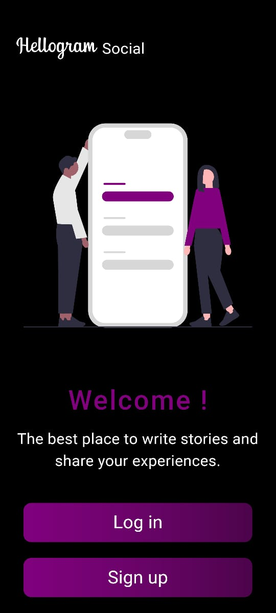</td>
        <td>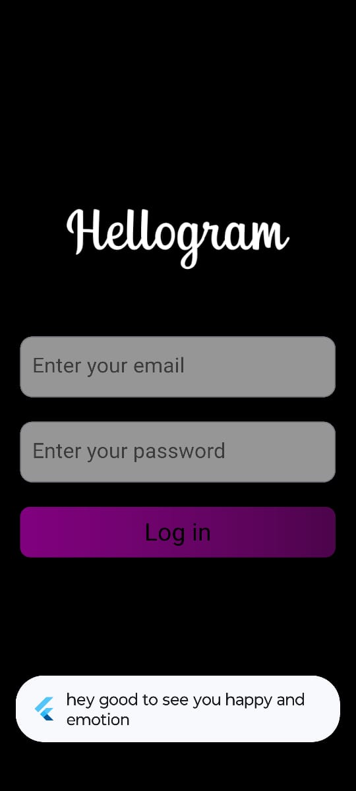</td>
          <td>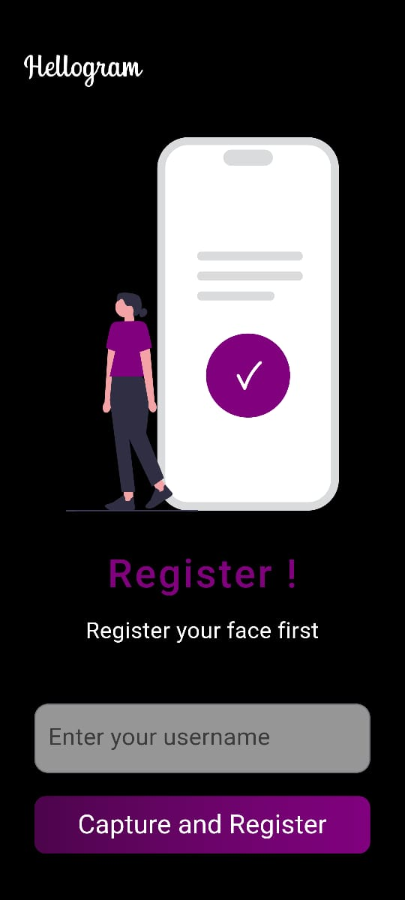</td>
         <td>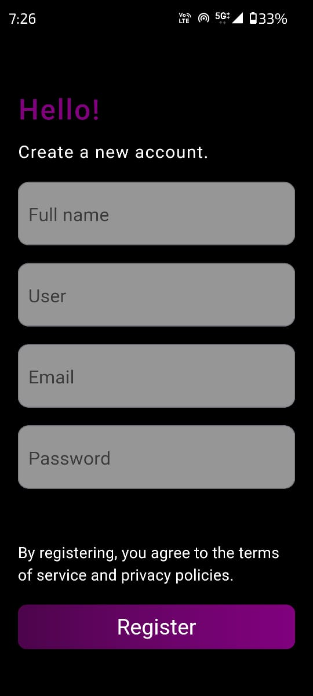</td>
    <tr>
</table>

<table border>
    <tr>
        <th style="text-align:center">Profile</th>
      <th style="text-align:center">Privacy</th>
        <th style="text-align:center">Update Profile</th>
        <th style="text-align:center">password Change</th>
    </tr>
    <tr>
        <td>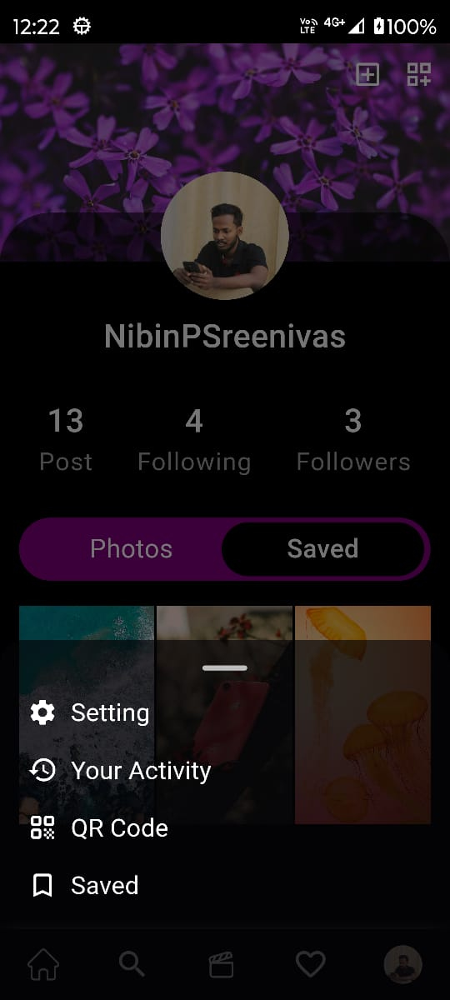</td>
        <td>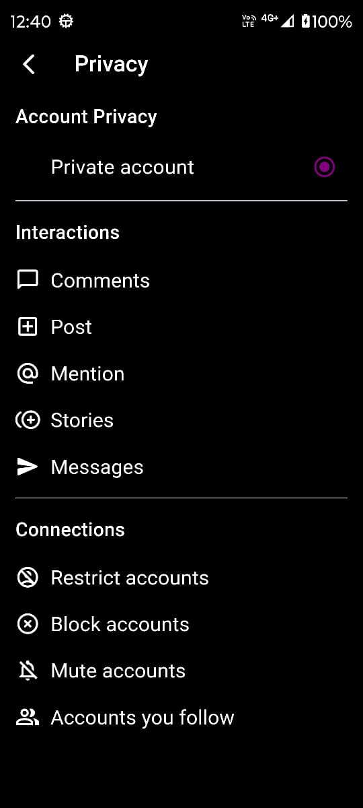</td>
          <td>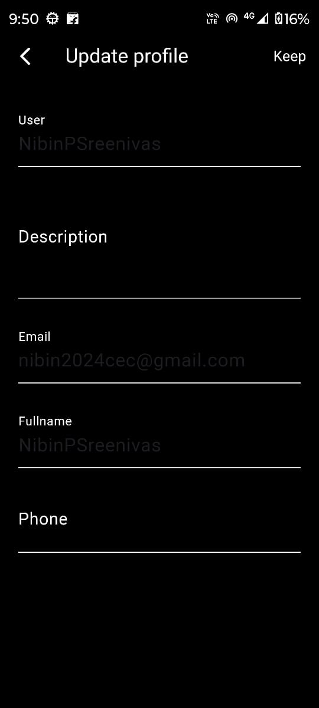</td>
         <td></td>
    <tr>
</table>

<table border>
    <tr>
        <th style="text-align:center">QRcode</th>
      <th style="text-align:center">Chat List</th>
        <th style="text-align:center">Chat</th>
        <th style="text-align:center">Post</th>
    </tr>
    <tr>
        <td>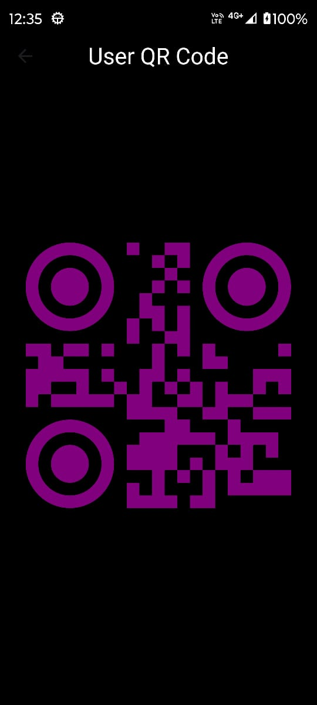</td>
        <td></td>
          <td>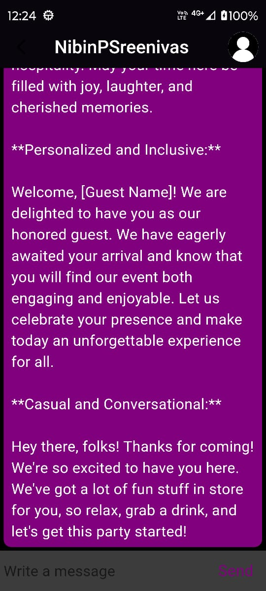</td>
         <td>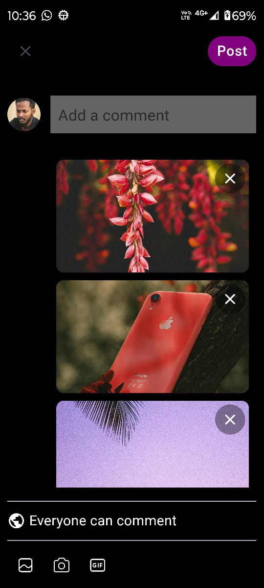</td>
    <tr>
</table>

## Features Includes:  

1. ### Photo-based Search
   🔍 Photo-Based Search: Looking for something specific? Simply upload a photo, and let our innovative search feature do the rest! Discover content like never before.
   
3. ### Emotional detection for post recommendation
   😃 Emotion-Driven Reels: Experience a personalized journey every time you log in! Our dynamic video reels change based on your emotions, making every scroll session uniquely yours.
   
5. ### Encrypting and Decrypting the messages
    🔐 Encrypted Messaging: Keep your conversations private with our rock-solid encryption using the trusted Caesar cipher method. Your messages stay between you and your intended recipient, safe from prying eyes.
    
6. ### Generative Message for chatting
   Hey! Ready to dive into some lively conversation? Let's spark some magic with our words! 💬✨
   
7. ### Biometric Authentication
   🔒 Secure Login: Say goodbye to worries about privacy breaches! With our state-of-the-art biometric authentication, like fingerprint recognition, your login is as secure as it gets.
   
9. ### User Privacy
   🔏Allowing users to lock their profiles provides them with a sense of control over their online presence.

 
## ✨ Requirements

* Any Operating System (ie. MacOS X, Linux, Windows)
* Any IDE with Flutter SDK installed (ie. IntelliJ, Android Studio, VSCode etc)
* A little knowledge of Dart and Flutter
* A brain to modify it
 

## App Flutter backend 

- https://github.com/nibinpsreenivas/Hellogram-node-js-backend/
